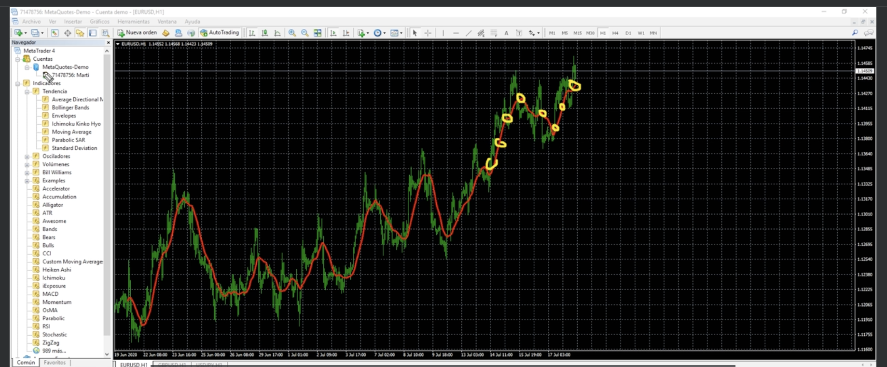

# mql4-course
MQL4 Course Notes: https://www.udemy.com/course/aprende-a-programar-en-mql4-desde-cero/

## MQL4 (MetaQuotes Language 4)
---

To write script or develop for Meta Trader 4

The following config for metaeditor can improve the colors of the editor using dark mode:

Steps to apply the colors:

1. Open MetaEditor
2. Open Folder Data
3. Open config folder
4. Open metaeditor.ini
5. Put the following code at the end of the file.
```
[Colors]
Color0=2302755
Color1=13882323
Color2=14737632
Color3=16102666
Color4=11119017
Color5=42495
Color6=9541731
Color7=65280
Color8=16775720
Color9=10025880
Color10=65535
Color11=16748574
Color12=64636
Color13=12616447
Color14=16711935
```

6. Restart the metaeditor.


## Connecting code with the market

To connect our code with the market an event should be triggered.
The main trigger for an event are the ticks.

- Tick: The minimum amount of change size in the price of an active.
This change could be in the price of the bit and the ask.

Our program will be execute when a new Tick is received. This could occurs in milliseconds.

The code on MQL4 should be compiled to be executed.

So, our program will not be executed all time. Just will be executed when a new Tick is received.
This means our program could be executed more frequently in some times of the day when there are more movements in the market.


## Control Triggers


There are some special triggers to control when our code could be executed.

OnTick(): Occurs after a change on the price.
OnTimer(): Occurs after a change in the time.
OnStart(): Occurs when the script is started.
OnStop(): Occurs when the script is stopped.


## Variables

MQL4 is a typed language. This means that we need to specify the type of the variable.

Example for integer variable:
```
int myvar = 20;
```

Datetime vars:
```
datetime date1 = D'2020.07.01';
datetime date2 = D'2020.07.06 15:45';
datetime date3 = D'06.07.2020 15:45';
datetime date4 = D'2020.07.06 14:16:30';
Print("Date1 is: ", date1);
Print("Date2 is: ", date2);
Print("Date3 is: ", date3);
Print("Date4 is: ", date4);
```

## Docs

Take a look at more information about mql4 types and variables:
https://docs.mql4.com/basis/types

Take a look at more information about mql4 functions:
https://docs.mql4.com/basis/functions


## Operators

https://docs.mql4.com/basis/operators


## Exercise 1

Check if the number is even or odd.
```
int mynumber = 55;
if (mynumber % 2 == 0) {
  Print("Even number");
} else {
  Print("Odd number");
}
```

## Exercise 2

Get all the numbers that can be divided by 5 between 1 and 50.
```
int index = 1;
while (index <= 50) {
  if(contador % 5 == 0) {
    Print("The number ", index, " can be divided by 5.");s
  }
  index++;
}
```

## Exercise 3

Raise numbers to the square
for(int i = 1; i < 21; i++) {
   Print("The number ", i, " raised to the square is: ", i*i);
}

## Exercise 4 (Switch Case)

```
int code = 10;
switch(code) {
   case 10:
      Print("Botella de agua");
      break;
   case 20:
      Print("Lata de refresco");
      break;
   case 30:
      Print("Chocolate");
      break;
   case 40:
      Print("Gominolas");
      break;
   case 50:
      Print("Galletas");
      break;
   default:
      Print("Este producto no está disponible");
      break;
}
```

## Exercise 5 (Functions)

```
void OnStart() {
 bool pajaro_1_cantando = true;
 bool perro_esta_ladrando = Perro_Ladrando(Pajaro_2_Cantando(pajaro_1_cantando));
 Print("¿El perro está ladrando? La respuesta es: ", perro_esta_ladrando);
}

bool Pajaro_2_Cantando(bool p1_cantando){
   return(!p1_cantando);
}

bool Perro_Ladrando(bool p2_cantando){
   return(!p2_cantando);
}
```


## Arrays

Arrays on MQL4 can contain up to 4 dimensions.

```
int array1[];  // Dynamic
int array2[3];  // Static
int array3[][3];  // 2D Array: 3 static columns, dynamic rows
int array4[][3][4];  // 3D Array
int array5[][3][4][5];  // 4D Array
```

Filling out arrays
```
int array1[5] = {1, 2, 3, 4, 5};  // Dynamic
int array2[3] = {1, 2, 3};  // Static
int array3[][3] = {{1, 2, 3}, {4, 5, 6}, {7, 8, 9}};  // 2D Array: 3 static columns, dynamic rows
int array4[][3][4] = {{{1, 2, 3, 4}, {5, 6, 7, 8}, {9, 10, 11, 12}}};  // 3D Array
int array5[][3][4][5] = {{{{1, 2, 3, 4, 5}, {6, 7, 8, 9, 10}, {11, 12, 13, 14, 15}}, {{16, 17, 18, 19, 20}, {21, 22, 23, 24, 25}, {26, 27, 28, 29, 30}}}};  // 4D Array
```


## Types of Programs

Scripts:
- Executed only one time: OnStart()
- They are deleted after execution: OnStop()
- Trading: Operations in the market can be executed
- Can NOT create graphic elements.
- Simultaneous execution: Only one script can be executed at the same time.
- Can't execute other programs

Experts:
- Executed in the chart for indefinitely time after every Tick().
- They are deleted after the chart is closed.
- Trading: Operations in the market can be executed
- Can create graphic elements.
- Simultaneous execution: Only one expert can be executed at the same time.
- Can execute other programs (Scripts or expert Advisors): iCustom()

Indicators:
- Executed in the chart for indefinitely time after every Tick().
- They are deleted after the chart is closed.
- Trading: Operations in the market can NOT be executed
- Can NOT create graphic elements. 
- Simultaneous execution: We can have multiple indicators in the chart.
- Can't execute other programs


Only Scripts and Experts advisors allow to execute trading operations.
Only the Indicators can create graphic elements.
The graphic elements can be created in the chart using buffers.
The simultaneous execution of scripts and experts is not allowed.
The simultaneous execution of indicators is allowed.
Desde un expert Advisor es posible llamar a un script o indicador usando iCustom()
Pero desde un script o indicador NO es posible llamar a otro script, indicador, o un expert advisor.


## Trade Functions

There are many trade orders that can be executed. More info about them here:
https://docs.mql4.com/trading


## Order Types

We can return order operation type of the currently selected order using the function:

```
// https://docs.mql4.com/trading/ordertype
int  OrderType();
```

Order operation type of the currently selected order. It can be any of the following values:

```
OP_BUY - buy order,
OP_SELL - sell order,
OP_BUYLIMIT - buy limit pending order,
OP_BUYSTOP - buy stop pending order,
OP_SELLLIMIT - sell limit pending order,
OP_SELLSTOP - sell stop pending order.
```


## Errors Management

After an error occurs, the function will return a boolean value, but the program execution will continue.

To get the value of the error we can use the function:
https://docs.mql4.com/check/getlasterror
```
int GetLastError();
```

For more information about the type of errors we can check the error codes:
https://docs.mql4.com/constants/errorswarnings/errorcodes


## Creating a Script

### Script: Close all trade orders

```
#property copyright "Copyright 2024, MetaQuotes Ltd."
#property link      "https://www.mql5.com"
#property version   "1.00"
#property strict

//-- Include
#include <stdlib.mqh>

void OnStart() {
   // Check if there are any open orders
   if (OrdersTotal() != 0) {
      int errorsCount = 0;
      // Loop through all open orders in reverse order
      for (int i = OrdersTotal() - 1; i >= 0; i--) {
         // Select the order by its position in the list of open orders
         if (OrderSelect(i, SELECT_BY_POS, MODE_TRADES)) {
            // Get the type of the selected order
            int orderType = OrderType();
            // Skip pending orders (buy limit, sell limit, buy stop, sell stop)
            if (orderType == OP_BUYLIMIT || orderType == OP_SELLLIMIT || orderType == OP_BUYSTOP || orderType == OP_SELLSTOP) {
                if (!OrderDelete(OrderTicket(), clrNONE)) {
                    Print("Error: ", ErrorDescription(GetLastError()));
                    errorsCount++;
                }
            } else {
                // Close market orders (buy or sell)
                if (orderType == OP_BUY) {
                    if (OrderClose(OrderTicket(), OrderLots(), MarketInfo(OrderSymbol(), MODE_BID), 0, clrNONE)) {
                        Print("Closing BUY order with ticket: ", OrderTicket(), " and ", OrderLots(), "lots");
                    } else {
                        Print("Error: ", ErrorDescription(GetLastError()));
                        errorsCount++;
                    }
                } else {
                    if (OrderClose(OrderTicket(), OrderLots(), MarketInfo(OrderSymbol(), MODE_ASK), 0, clrNONE)) {
                        Print("Closing SELL order with ticket: ", OrderTicket(), " and ", OrderLots(), "lots");
                    } else {
                        Print("Error: ", ErrorDescription(GetLastError()));
                        errorsCount++;
                    }
                }
            }
         }
      }
      if (errorsCount == 0) {
         Print("All pending orders have been closed");
      } else {
         Print("Total errors: ", errorsCount);
      }
   } else {
      Print("No pending orders to close");
   }
}
//+------------------------------------------------------------------+

```

## Indicators

An important concept for creating an indicator it's the Buffer.

Buffer: A buffer is an array of values of all calcs made by our indicator.
These values are used to be able to draw something in the chart.




The indicators can works on the main chart or in a anidated window in the chart inside the main chart

For example you can take a look at the MACD.

For each indicator we should use a different buffers.


### Let's create our first indicator

The name of our indicator will be: "statistical volatility"

We will create a simple indicator that will calc the volatility of the price.

In the wizzard to create indicators, we should choose the type of events that will trigger the indicator.


- Type of events:

OnCalculate(): This is triggered after a new tick.
OnTimer(): When the timer event is triggered. We can trigger this after every x times.
OnChartEvent(): This is triggered after any interaction with the chart. For example, when we click on the chart, when we move the mouse over the chart, etc.


Also we should configure the visualization parameters of the indicator.


These parameters represents the buffers to store the data for the visualization in the chart.
We can draw the indicator in a separated window or in the main chart.


### Customization (Icons)

We can configure the icon of the script when this is added to the chart in the configuration window.
We should create a new folder "Icons" in the root of the MQL4 folder and add the icon there.
The files should be in .ico format.
For metatrader it's recommended files with 64x64 pixels.


### Indicator methods

#### onInit()

This is triggered when the indicator is added to the chart, this is executed only the first time.
At the end of the execution we should return a value.


```
int OnInit()
  {
//--- indicator buffers mapping
   SetIndexBuffer(0,buffer_volBuffer);
   SetIndexBuffer(1,buffer_mediaBuffer);
   
//---
   return(INIT_SUCCEEDED);
  }
```


#### onCalculate()

This will triggered after any new tick change on the price.

```
int OnCalculate(const int rates_total,
                const int prev_calculated,
                const datetime &time[],
                const double &open[],
                const double &high[],
                const double &low[],
                const double &close[],
                const long &tick_volume[],
                const long &volume[],
                const int &spread[])
  {
//---
   
//--- return value of prev_calculated for next call
   return(rates_total);
  }
```

### Project: Develop an indicator to calculate the statistical volatility of the price

Statistical Price Volatility refers to the degree of variation in the price of a financial instrument over a specific period of time. It is a measure of the dispersion of returns and is often calculated using statistical methods such as standard deviation or variance. High volatility indicates a high degree of price variation, while low volatility indicates a more stable price movement.


Statistical volatility is defined as the standard deviation of the logarithm of returns.


The standard deviation is defined as the average size of the deviations from its mean. The further the price deviates from its mean, the greater the volatility.

Finally, statistical volatility is defined as the standard deviation of the natural logarithm of returns.

The following is the formula to calc the volatility:


There are predefined methods on MQL4 to calc the standard deviation like **iStdDev()**.

We can find the indicator code in the file: [**indicators/statisticalVolatility.mq4**](indicators/0.statisticalVolatility.mq4)


# Creating an Expert Advisor

Strategy for the expert advisor:


Take a look at the code for this expert advisor in the file: [**experts/ustomStrategy.mq4c**](experts/customStrategy.mq4)